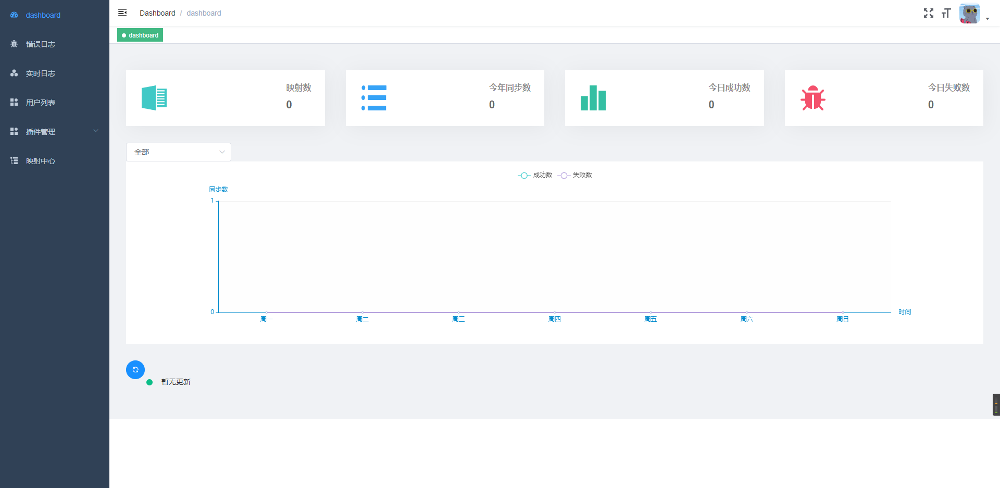

毕设/课设项目展示
# Android/ios项目展示：
# Here
一款在线寻找附近用户活动的App
* 活动实地显示：通过地图显示活动的具体位置。

* 活动信息筛选：提取附近一定范围内的活动信息。

* 活动在线申请：实时推送活动发布和申请信息。

* 用户在线沟通：IM模块确保用户间的沟通。

* 社区爱好分享：类似于朋友圈的帖子互动。

* 发现附近好友：用一张图片作为展示，吸引附近好友来打招呼。

# 界面展示

# SmallExcellent

一个使用了mvp+bmob+高德地图sdk+litePal的兼职工作平台项目

    *登录模块

    *注册模块

    *主界面模块

    *路线规划模块

  

    *兼职查询模块

# web前端网页与小程序开发案例

